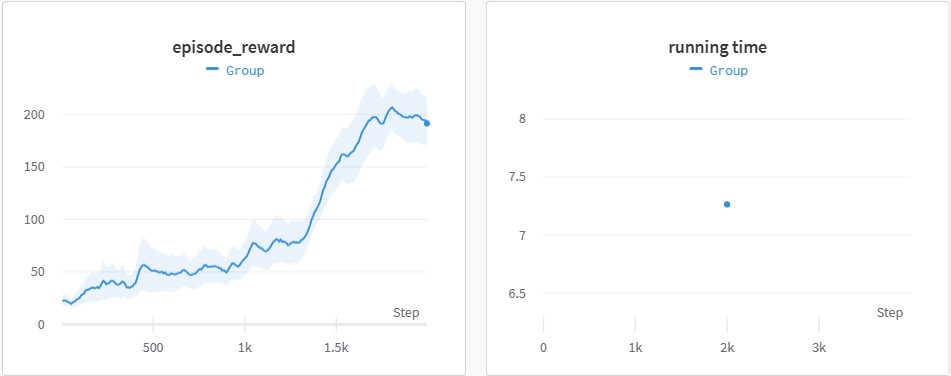

# pytorch-a3c

This is a PyTorch implementation of Asynchronous Advantage Actor Critic (A3C) and a toy example on the CartPole-v1 from ["Asynchronous Methods for Deep Reinforcement Learning"](https://arxiv.org/pdf/1602.01783v1.pdf).

This implementation is inspired by [Universe Starter Agent](https://github.com/openai/universe-starter-agent) and ikostrikov's implementation of A3C(https://github.com/ikostrikov/pytorch-a3c/tree/master).

For comparison, an a2c implementation on cartpole-v1 is provided.

The test.py in the example folder is useless, just for debugging.

According to my experience, if the example is trained on the server , "torch.multiprocessing.set_start_method("spawn")" should be add at the top of the main.py. 

## pseudocode
```python
def [int] jobs
def [agent class] global_agent
def [share_value] i_episode

global_agent.network.share_memory()
for i in range(jobs):
    create_process(local_env, local_agents, shared_network)
In each process:
    while i_episode(shared) < training_epiosde:
        network_parameters_synchronization(shared_network, local_agent.network) ---> None
        agent.run_an_episode(local_env) ---> buffer
        sample_a_batch(buffer) ---> batch
        compute_grad(batch) ---> grad
        update_shared_network(grad) ---> None
```

## difference between A2C and A3C
1. multiple independent process. 
2. there are shared global network and episode counter which cross all processes. all local things and global things have same framework.
3. grads were computed in assistant processes and were used in the main process to update the global network. 
4. synchronization of network parameters  before run a episode.

## implementation details
### shared network/variable
1. the network and variables of global agent should on CPU since tensor on GPU can't be moved to shared memory and a wrong tensor(zero tensor usually) will be visited in the assistant process.no device limit of local network and variables in the assistance process.
2. the synchronization of network parameters can be directly done by `local_model.load_state_dict(shared_global_model.state_dict())`, no matter they're on the same device or not.
3. the shared episode counter or other counter is `multiprocessing.Value`. the value of such share variable can be visited and edited via `X.value` 
4. all operation of shared things should be edition rather than direct assignment if you want it still points to the original memory address
### gradient and optimizer
1. if `torch.optim` was used as the optimizer of global network, it works finitely even it was defined before the network was moved to shared memory or GPU.
2. `optim.zero_grad` will fail when the network was moved to share memory while the `optim.step` works if the tensor has grad. before update, by defination, the grad of parameters is None. it should be chage to zero tensor than add the grad computed by `torch.autograd`
3. i don't known if `objective.backward()` works with shared network/variables.
4. you can also used a shared optimizer like https://github.com/ikostrikov/pytorch-a3c/blob/master/my_optim.py
### episode infromation
1. the action(log\pi) buffer should be the original tensor outputed by the actor networt since it contains grad information. to make it, use `torch.cat` to catch the action(log\pi). no such limit of state and reward(from environment) buffer.
### lock 
1. a lock may be needed when print reward/episode or use wandb to log data.
### wandb
1. all the processs use the same wandb run_handle

## result on cartpole
### training and time cost

#### A3C(jobs=3)
")

#### A2C


